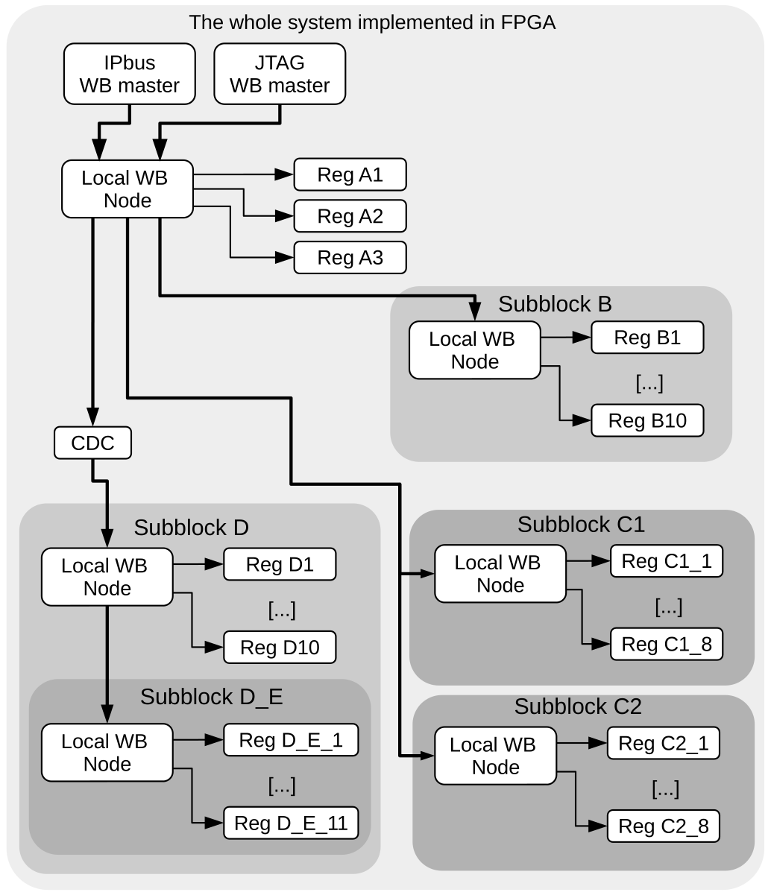

Overview
--------

Address Generator for WishBone (AGWB) is a tool for automatic management of local bus address space in complex FPGA systems.
Its main advantage, comparing to other open source solutions, is the support for complex hierarchical systems.
:numref:`fig_example_hierarchical_system` shows an example of a hierarchical system.

   The block diagram of an example design built in the FPGA using the AGWB.
   The CDC block provides the clock domain crossing functionality.
   It allows subblocks D and D_E to run with another clock than the rest of the system.

Local bus
#########

As the local control bus, the Wishbone bus was chosen.
It is used in the classic single mode.
In this mode, it may control both the Wishbone and IPbus slaves, which gives access to multiple open IP cores.
It is possible to control the local bus from the IPbus master.
Additionally, there are bridges providing control of the Wishbone bus from other busses like Avalon or AXI.
Therefore, such selection of local bus ensures high versatility and flexibility of the created control infrastructure, which is desirable, even though it provides lower performance than pure AXI bus.

Allocation of adresses
######################

To enable optimal implementation of address decoders the address space for each block requiring the K addresses, where :math:`0 < K < 2^N` is aligned to the :math:`2^N` boundary so that N bits are used for internal addressing in the block.
To ensure efficient utilization of the address space, the required size of the address space for each block is calculated, traversing the system description from the most nested blocks to the top.
After that, the blocks are ordered in the order of decreasing size of their address space, and their base addresses are set with the proper alignment.

Input
#####
As an input AGWB accepts system registers structure described in *.xml* format.
This is further described in :ref:`XML description` chapter.

Output products
###############
AGWB always generates VHDL files appropriate to the defined blocks.
User should expect following VHDL files to be generated.

#. *{top_name}_const_pkg.vhd* - package with constants defined in input *.xml* files.
#. *{block_name}_pkg.vhd* - package for given block.
   Packages for distinct blocks are generated into distinct files.
   These packages contain various constants, subtypes, types definitions and conversion functions related to given block. 
#. *{block_name}.vhd* - entity for given block.
   Entities for distinct blocks are generated into distinct files.

Depending on the input arguments AGWB can also generate following helper files.

#. IPbus compatible register files.
#. C header files for ???.
#. Python files for ???.
#. Forth files for ???.
#. HTML registers documentation file.

To get to know how to generate these files execute :code:`python addr_gen_wb.py --help`.

License
#######

The code is licensed under GPL v2 license.
The generated code is free, and you can freely use it in your design.
